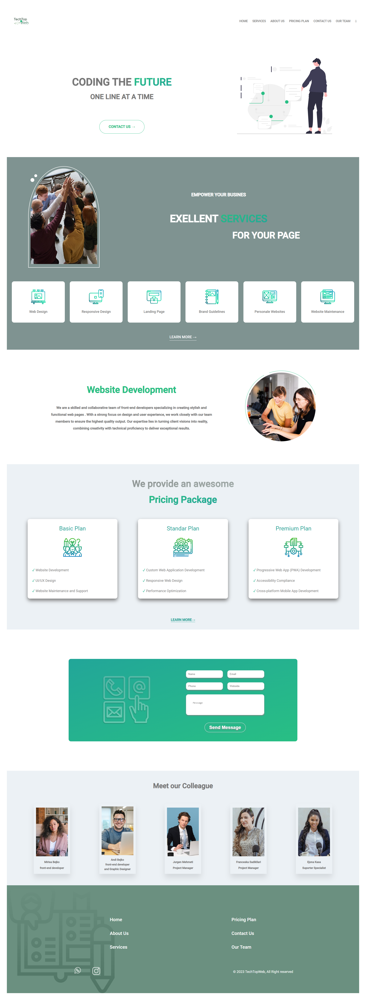

# TechTopWeb

## Project Description

TechTopWeb is a real Single-Page Application (SPA) project that aims to provide a responsive website for users. It offers various sections with valuable information and features to enhance user engagement.

## Installation

To run this project locally, you can either download the files directly from the [GitHub repository](insert_github_repo_url_here) or visit my [portfolio](https://mirisabejko.netlify.app/) for additional details.

## Usage

Users can interact with TechTopWeb to access information through different sections. The main functionalities include:

- Exploring the hero section that introduces the website's purpose.
- Filling in personal information that gets stored in the local storage and sent to the client.

## Features

- Hero section with an introduction to the website's purpose.
- User form for capturing and storing personal information.

## Screenshots or Demo

Check out the live demo of TechTopWeb: [Live Demo](https://techtopweb.netlify.app/)

## Technologies Used

TechTopWeb was built using the following skills and technologies:

- HTML
- CSS
- SASS
- JavaScript

## Contact Information

Feel free to contact me for any inquiries or feedback:

- Email: your.email@example.com

## Acknowledgments

I would like to acknowledge the following resources and tools that contributed to the development of TechTopWeb:

- [Bootstrap](https://getbootstrap.com/)
- [Font Awesome](https://fontawesome.com/)
- [Netlify](https://www.netlify.com/)

## License

This project is licensed under the [MIT License](insert_license_url_here).
